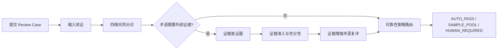
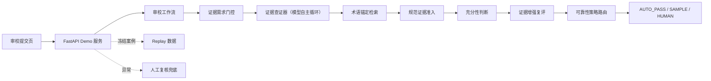

# 面向大模型译文的审校决策 Agent（Review Decision Agent）

> 面向中小全球化内容团队的翻译审校决策产品原型。系统不直接信任大模型审校结果，而是把"何时相信模型、何时调用外部证据、何时升级人工"拆成可审计的决策链，为每条译文找到合适的处理路径。


**[在线体验](https://llm-translation-review-decision-agent.onrender.com)** · **[查看源码](https://github.com/curious-leila/llm-translation-review-decision-agent)**

---

## 30 秒了解项目

**核心定位：译文生成后的审校质量决策层。** 用户输入原文与候选译文，Review Agent 不修改译文，而是判断这条译文该走哪条审校路径：自动通过、抽样复核还是人工复核。

营销文案、产品界面、客服话术每天都有大量译文需要审校。全量人工复核成本高，直接信任大模型审校结果又有质量风险：模型可能漏判术语错误，也可能在证据不足时自信放行。

本项目把单个译文封装为 Review Case（原文 + 译文 + 场景信息），通过风险分诊、受控证据查证和可靠性策略，输出三条路径：自动通过、抽样复核、人工复核。

Review Agent 要回答的问题不是"模型审校得准不准"，而是：**在尽可能控制译文风险的前提下，能安全地授予模型多大自主权，从而把人工复核成本降到多低。**

### 项目信息


| 项目维度 | 说明                                     |
| ---- | -------------------------------------- |
| 项目类型 | AI 审校决策 Agent / 求职作品集项目                |
| 我的角色 | AI 产品经理、产品设计、系统实现                      |
| 负责范围 | 需求定义、产品决策、评测设计、Agent 工作流实现、Demo 前后端与部署 |
| 目标用户 | 需要译文审校把关的团队与个人（营销文案、客服话术与产品界面的译文适用场景）    |
| 核心场景 | EN 到 zh-CN 的市场营销、产品文案、客服话术审校           |
| 当前状态 | 可本地运行与部署的产品原型                          |


---


## 问题定义

需要译文把关的团队普遍面临一个矛盾：**复核成本与质量风险不可兼得。**

- 全量人工复核成本高，无法覆盖所有译文；
- 直接信任大模型审校结果，模型可能漏判、错判，或在证据不足时自信放行；
- 模型回答缺少可审计依据，出问题时无法定位是哪一层判断失误。

如果让模型同时负责"发现问题、查找证据、判定证据有效、决定放行"，等于让模型给自己发通行证。

因此我将产品目标定义为：

> 用户提交原文与候选译文，系统判断该译文的审校路径：自动通过、抽样复核或人工复核。自动化的边界由双指标约束：安全自动放行率（Safe Auto-pass Rate）衡量收益，错误自动放行率（False Auto-pass Rate）是不可突破的护栏；两者需在真实审校流量中度量，当前原型验证的是决策机制是否符合设计。

---


## 产品方案


### 核心机制：自主权治理

产品以单一 Agent 形态对外，内部不是多 Agent 协作，也不是纯 LLM 调用链：证据查证器是唯一的模型自主循环环节，其余环节均为确定性规则或单次模型判断。模型负责不确定性探索，规则负责安全边界，人工负责最终兜底，任一层失败都安全退出，而不是继续自动化。

系统按职责拆分证据链，每层只拥有必要权限：


| 职责     | 回答的问题         | 归属                 |
| ------ | ------------- | ------------------ |
| 证据需求门控 | 当前判断是否需要外部证据  | 规则 + 模型            |
| 原文术语契约 | 待查证对象到底是什么    | 确定性校验              |
| 证据查证器  | 去哪里找、怎么继续找    | 模型驱动，动作空间与停止权由规则限定 |
| 证据准入   | 候选有没有资格成为可信证据 | 确定性规则              |
| 证据充分性  | 证据够不够覆盖当前问题   | 确定性规则              |
| 停止规则   | 证据充分后谁决定停止    | 规则接管               |
| 最终路由   | 自动通过、抽样还是人工   | 可靠性策略              |


### 用户流程



### 核心体验


#### 1. 四维风险分诊

系统对准确性、受众适配、语言规范、术语一致性四维打分，输出风险等级与未决问题，而不是一段泛化的审校意见。

#### 2. 受控证据查证

只有术语维度需要外部事实时才启动证据查证器。查证器只拥有三个动作：搜索官方来源、证据充分时停止、证据不足时弃权。它不能修改风险等级，不能决定证据资格，更不能决定最终放行。

#### 3. 证据增强复评

证据回流后，由独立节点基于可信证据重新做术语判断。找到证据的角色与基于证据下判断的角色分离。

#### 4. 可见的决策过程

页面展示最终路由、风险维度、证据引用、Agent 执行轨迹与未决问题。任何一条结论都能回答"凭什么这么判"。

#### 5. 失败降级

模型服务异常、输出格式非法或证据不足时，系统安全转入人工复核，不拿坏输出继续做自动决策。

---


## 关键产品决策


| 产品问题                           | 我的判断                  | 解决方案                                            |
| ------------------------------ | --------------------- | ----------------------------------------------- |
| 全量人工复核贵，直接信模型危险                | 单一模型判断无法同时保证效率与安全     | 拆为三层：确定性规则守安全边界，单一受限 Agent 做需要环境反馈的查证，无法确认时人工兜底 |
| 模型既判断又取证又放行                    | 等于自己给自己发通行证           | 取证权、判断权、放行权分离到不同层                               |
| 模型找到候选就当证据                     | 检索命中不等于事实可信           | 设规范证据准入，候选必须通过确定性资格规则                           |
| 证据有资格就当足够                      | 有资格不等于覆盖当前问题          | 设证据充分性判断，要求事实覆盖未决 claim                         |
| 证据已足够模型仍在搜索                    | 停止权不应属于模型             | 充分条件成立后由规则接管，历史案例从 4 次工具调用收敛到 1 次               |
| 模型输出"COOL TENCEL™（含品牌成分）"被准入拒绝 | 问题在上游查证对象定义，不在下游规则    | 收紧为原文最小连续片段契约，不放宽准入换取通过                         |
| 真实模型查询表达多变，补词追不完               | 自由文本 Query 不该承担身份安全职责 | 落地术语锚定检索：查谁由 term_candidate 确定，Query 只做探索与排序    |


---


## Demo 事实边界

公开 Demo 由不同状态组成，避免混淆：


| 能力     | 状态       | 说明                                                                              |
| ------ | -------- | ------------------------------------------------------------------------------- |
| 案例回放   | 可用       | 4 个冻结案例（CS-020 无需查证、MKT-020 证据验证、MKT-005 人工复核、UI-003 自动通过），前端直接渲染完整决策过程，无需后端    |
| 在线真实验证 | https://llm-translation-review-decision-agent.onrender.com | 在页面粘贴原文与候选译文，后端接入真实模型 API 处理，返回完整决策链与路由结果                                       |
| 会话记忆   | 未接入 Demo | 记忆模块代码已实现，当前演示工作流未启用长期记忆                                                        |
| 实时证据检索 | 术语锚定已落地 | 公网真实提交已验证可用；需外部证据案例的端到端成功闭环仍待单独验证，结论见 [证据层设计复盘](docs/evidence_layer_review.md) |


---


## 系统架构



Demo 为前后端一体应用：一个 FastAPI 服务同时提供审校接口与页面静态资源，本地一条命令即可运行，部署到 Render 一个服务即可对外提供完整体验。

---


## 技术实现


### Demo 应用

- Python（FastAPI + Pydantic）：审校接口、输入校验与结果契约
- 原生 HTML / CSS / JavaScript：单页 Demo，无前端框架、无构建步骤、无包管理依赖
- 冻结 Replay 数据驱动案例回放


### 审校工作流

- LangGraph 状态机编排，节点职责单一
- 四维风险分诊（准确性 / 受众 / 语言 / 术语）
- 受控证据链：门控、术语锚定检索、准入、充分性、停止规则
- DeepSeek OpenAI 兼容接口，模型与超时可通过环境变量切换


### 证据数据

- 冻结证据包：12 条正向规范事实 + 2 条负向控制（Signal、PayPal、TENCEL 等品牌来源族）
- 证据加载带文件完整性校验，运行时事实与冻结版本逐字段一致
- 检索不采用 OR、模糊匹配或子串投机规则

---


## 产品验证

当前阶段以产品原型与工程验收为主，不使用未经验证的业务增长数据。

已完成的验证包括：

- 114 个自动化测试覆盖 Demo API、证据包完整性校验、检索准入充分性集成、审校工作流与页面可读性，全部通过；
- MKT-020 案例经多次真实模型运行：证据不足时系统安全弃权并转入人工复核，未伪造成功结果；
- 证据链职责分离经真实失败验证：检索命中、语义相关、准入拒绝三种结果可在同一案例中并存；
- 历史案例停止规则修复：证据充分后工具调用从 4 次收敛到 1 次；
- 证据包冻结事实与运行时逐字段一致，文件篡改会被完整性校验拦截。

已知边界：公网 Demo 已接通真实模型 API，真实提交可正常返回路由结果；但“需要外部证据的案例完整走通查证并命中证据”的端到端成功闭环尚未单独验证。Demo 页面默认展示冻结案例回放以保障演示稳定，同时开放真实提交入口。完整验收结论见 [证据层设计复盘](docs/evidence_layer_review.md)。

如果进入真实用户测试阶段，我会重点观察：


| 指标                                | 用途                   |
| --------------------------------- | -------------------- |
| 安全自动放行率（Safe Auto-pass Rate）      | 验证安全约束下自动化能正确处理的案例比例 |
| 错误自动放行率（False Auto-pass Rate）     | 护栏：本应人工介入却被自动放行的比例   |
| 人工复核升级率（Human Review Rate）        | 判断弃权与升级策略是否过紧或过松     |
| 单案例处理时长（Per-case Processing Time） | 衡量分诊链路相对全量人工的收益      |


---


## 我在项目中展示的能力

- 把"译文由谁复核"定义为路径决策产品：用户提交原文与候选译文，系统输出自动通过或人工复核，并用双指标约束自动化收益与风险；
- 基于前置人机双评实测，把模型能力评测结论转化为自主权边界，而非停留在准确率分数；
- 将证据链拆为取证、判断、放行三层职责，真实失败均修复在对应层，未以放宽准入或模糊匹配换取表面成功；
- 识别自由文本 Query 承担身份安全职责的结构性错误，落地术语锚定检索，把"查谁"交回确定性契约；
- 独立完成从需求定义、产品决策、评测设计到工作流实现与 Demo 前后端的完整闭环；
- 在自动化收益与质量风险之间做显式取舍，并以文档形式公开未达标项。

---


## 本地运行


### 1. 安装

需要 Python 3.12 或 3.13。

```bash
python -m venv .venv
# Windows PowerShell
.\\.venv\\Scripts\\Activate.ps1
pip install -e .
```

### 2. 启动离线模式（无需模型 Key，适合快速预览）

```bash
uvicorn review_triage.demo.offline:app --port 8000
```

打开 [http://127.0.0.1:8000/](http://127.0.0.1:8000/)，可体验案例回放与本地模拟审校。

### 3. 启动真实模型模式

复制 `.env.example` 为 `.env`，填写 `DEEPSEEK_API_KEY`：

```bash
uvicorn review_triage.demo.live:app --port 8000
```

请勿将真实 API Key 提交到 GitHub。模型名可通过 `DEEPSEEK_MODEL` 切换。

### 4. 运行测试

```bash
python -m unittest discover -s tests
```

---


## 项目结构

```text
.
├── README.md
├── docs/
│   ├── PRD.md                      # 产品需求文档
│   └── evidence_layer_review.md    # 证据层设计复盘
├── src/review_triage/              # 审校工作流核心（内部标识沿用 review_triage）
│   ├── demo/                       # Demo 应用（FastAPI 前后端一体，含接口限流）
│   ├── demo_evidence_pack_v1.py    # 冻结证据包加载器
│   └── demo_evidence_retrieval_v2.py # 术语锚定检索
├── tests/                          # 自动化测试
├── artifacts/demo_evidence_v1/     # 冻结证据包（Demo 数据源）
├── prompts/
│   ├── review_agent_v1/            # 产品 Prompt 现行版本
│   └── evaluator_baselines/        # 四维评测基线 Prompt
├── pyproject.toml
└── .env.example
```

### 延伸阅读

- [产品需求文档](./docs/PRD.md)
- [证据层设计与复盘](./docs/evidence_layer_review.md)

---


## 后续迭代方向

- 接入会话记忆，支持跨轮审校上下文；
- 建立真实用户评测集，跟踪安全自动放行率与错误自动放行率；
- 支持更多语言方向与内容类型；
- 将证据来源追溯升级为原始文件级存档。

---


## 项目说明

本项目为独立完成的求职作品集项目。演示案例中的品牌名称与术语仅作为审校样本出现，用于说明受控证据机制，与相关品牌无任何关联。
