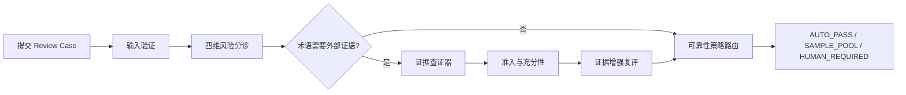

# PRD：面向大模型译文的审校决策 Agent（Review Decision Agent）

**版本**：V1.0

**产品形态**：网页提交 + 后端决策的审校 Agent

**产品定位**：用户提交原文与候选译文，系统判断该走自动通过、抽样复核还是人工复核，并给出可审计的决策依据。

---

## 1. 需求分析

### 1.1 行业背景

出海内容与本地化团队每天产生大量译文，质量把关普遍依赖人工复核，成本高且难以覆盖全部内容。商业本地化平台已开始用 AI 评估与自动路由降低人工审校量：Smartling 官方称其 LQA Agent 评估准确度约为人工审校员的 90%，配合定向人工校验可将人工审校范围缩减最多 90%；Lokalise 官方称评分路由可减少最多 80% 的后编辑工作量；Phrase 以 QPS 质量预测分数配合 Orchestrator 做自动编排。按质量分流、避免全量人工，是当前行业共同认可的方向。

### 1.2 竞品现状与差距

| 平台 | 做法 | 局限 |
| --- | --- | --- |
| Smartling | LQA Agent 按 MQM 错误类型与严重度规则分流，LQE Agent 输出质量等级 | 官方明确 LQA Agent 不检测 glossary / style / preferential 错误；能指出哪里错了，不回答证据是否可信、何时停止查询 |
| Phrase | QPS 0-100 质量预测 + 阈值路由与编排 | 阈值需人工调优，无外部事实治理 |
| Lokalise | Translation Scoring + AI LQA，低分或不可评分建 Review Task | 分数阈值路由，无查证与停止治理 |

三家平台的共同点：基于分数或错误严重度决定去向，没有把"外部证据是否可信、何时停止查询、模型该被授予多大自动化权限"作为独立决策层。本项目不做缩小版 TMS，差异点正在证据治理与自动化权限边界。

### 1.3 用户痛点

- 全量人工复核成本高，无法覆盖所有译文；
- 直接信任大模型审校结果，模型可能漏判、错判，或在证据不足时自信放行；
- 模型回答缺少可审计依据，出问题时无法定位是哪一层判断失误；
- 让模型同时负责发现问题、查找证据、判定证据有效、决定放行，等于让模型给自己发通行证。

### 1.4 需求定义

市场需要的不只是"给译文打分"，而是可解释的自动化权限决策：每条译文应该被自动放行、抽样还是人工复核，由风险维度与证据状态共同决定，且决策过程可回放、可审计。用户提交原文与候选译文后，系统在术语等维度需要外部事实时启动受控查证，最终由规则输出审校路径。

## 2. 产品定位与目标

### 2.1 核心定位

译文生成后的审校质量决策层。系统不生产译文，不代替人工定稿，而是决定每条已生成译文应该被信任、被抽检还是转人工。

### 2.2 产品目标

用户提交原文与候选译文，系统判断该译文的审校路径：自动通过、抽样复核或人工复核。

### 2.3 边界指标

自动化的边界由双指标约束，两者需在真实审校流量中度量：

| 指标                            | 定义                  | 角色      |
| ----------------------------- | ------------------- | ------- |
| 安全自动放行率（Safe Auto-pass Rate）  | 安全约束成立时被正确自动处理的案例比例 | 衡量自动化收益 |
| 错误自动放行率（False Auto-pass Rate） | 本应人工介入却被系统自动放行的比例   | 不可突破的护栏 |

当前原型阶段验证的是决策机制是否符合设计，指标数值不在原型阶段宣称。

## 3. 目标用户与核心场景

| 维度   | 说明                                                   |
| ---- | ---------------------------------------------------- |
| 目标用户 | 需要译文审校把关的团队与个人（出海内容、本地化、客服与产品文案等场景）                  |
| 核心场景 | EN 到 zh-CN 的市场营销、产品文案、客服话术审校                         |
| 系统输入 | Review Case：原文 + 候选译文 + 内容类型 + 可选业务上下文               |
| 系统输出 | 审校路径（AUTO_PASS / SAMPLE_POOL / HUMAN_REQUIRED）与完整决策链 |

## 4. MVP V1 范围

### 4.1 范围内

- Review Case 输入与校验；
- 四维风险分诊（准确性、受众适配、语言规范、术语一致性）；
- 证据需求门控：仅术语维度需要外部事实时启动查证；
- 原文术语契约：term_candidate 必须是原文最小连续片段；
- 证据查证器：搜索、充分即停、不足即弃权三个动作；
- 术语锚定检索、规范证据准入、充分性判断、停止规则；
- 证据增强术语复评（NODE02A）；
- 可靠性策略与最终路由（自动 / 抽样 / 人工）；
- 前后端一体的可部署 Demo 与冻结案例回放。

### 4.2 范围外（未完成）

- 会话记忆接入 Demo 工作流（代码已实现，未接线）；
- 多语言方向（当前仅 EN 到 zh-CN，Reliability Policy 不得默认跨语言复用）；
- 用户工作台、任务管理、审校队列等 B 端工程；
- 行为埋点与指标看板；
- 结构化 Tool Contract 重构（四段式入参，列为下阶段）。

## 5. 核心流程

职责归属原则：确定性规则守住安全边界（准入、充分性、停止、路由），模型只做不确定性探索（分诊判断、查询生成、相关性评估、证据复评），人工负责最终兜底。任一层失败都安全退出，不继续自动化。

## 6. 关键产品决策

| 产品问题           | 判断                    | 决策                           |
| -------------- | --------------------- | ---------------------------- |
| 全量人工贵，直接信模型危险  | 单一模型判断无法同时保证效率与安全     | 三层结构：规则守边界、单一模型循环做查证、人工兜底    |
| 模型既判断又取证又放行    | 等于自己给自己发通行证           | 取证权、判断权、放行权分离                |
| 模型找到候选就当证据     | 检索命中不等于事实可信           | 规范证据准入（Retrieved ≠ Admitted） |
| 证据有资格就当足够      | 有资格不等于覆盖当前问题          | 充分性判断（Admitted ≠ Sufficient） |
| 证据足够模型仍继续搜     | 停止权不应属于模型             | 充分条件成立后规则接管停止                |
| 模型输出复合短语导致准入全拒 | 问题在上游对象定义             | 原文最小连续片段契约，校验失败弃权转人工         |
| 真实查询表达多变，补词追不完 | 自由文本 Query 不该承担身份安全职责 | 术语锚定检索，Query 只做探索与排序         |

## 7. 功能清单

| 模块   | 功能点            | 一句话描述                                                    | 优先级 |
| ---- | -------------- | -------------------------------------------------------- | --- |
| 审校提交 | Review Case 表单 | 提交英文原文与候选译文，选择内容类型（营销文案 / 客服话术 / 界面文案），可选补充品牌领域与上下文说明    | P0  |
| 审校提交 | 输入验证           | 校验必填字段与内容类型，非法请求返回明确错误                                   | P0  |
| 风险分诊 | 四维风险分诊         | 对准确性、受众适配、语言规范、术语一致性四维输出风险等级与未决问题                        | P0  |
| 证据查证 | 证据需求门控         | 判断术语判断是否依赖外部证据，仅在必要时启动查证                                 | P0  |
| 证据查证 | 原文术语契约         | 待查术语必须是原文最小连续片段，校验失败直接弃权转人工                              | P0  |
| 证据查证 | 查证决策循环         | 搜索官方来源，依据命中或未命中改写下一步查询，充分即停、不足即弃权                        | P0  |
| 证据把关 | 术语锚定检索         | 以 term_candidate 为确定性锚点检索冻结证据包，Query 只做探索与排序             | P0  |
| 证据把关 | 规范证据准入         | 用确定性规则判断候选是否有资格成为可信证据                                    | P0  |
| 证据把关 | 充分性与停止规则       | 证据必须覆盖未决问题才算充分，充分后由规则接管停止权                               | P0  |
| 路径决策 | 证据增强复评         | 基于可信证据重新做术语判断，查证者不能直接改结论                                 | P0  |
| 路径决策 | 可靠性策略路由        | 输出自动通过（AUTO_PASS）、抽样复核（SAMPLE_POOL）或人工复核（HUMAN_REQUIRED） | P0  |
| 结果呈现 | 完整决策链展示        | 展示最终路由、风险维度、证据引用、查证轨迹与未决问题                               | P0  |
| 结果呈现 | 失败降级           | 模型异常、输出非法、证据不足时安全转入人工复核                                  | P0  |
| 演示能力 | 案例回放           | 4 个冻结案例（无需查证 / 证据验证 / 人工复核 / 自动通过）一键回放完整决策过程             | P0  |
| 演示能力 | 产品决策架构视图       | 页面内可视化展示分层决策权与真实运行时结构                                    | P1  |
| 扩展能力 | 会话记忆           | 跨轮审校上下文记忆，代码已实现、工作流未接入                                   | P2  |

## 8. 验收标准

### 8.1 机制验收（当前已完成）

- 自动化测试覆盖 Demo API、证据包完整性、检索准入充分性集成、审校工作流与页面可读性，全部通过；
- Demo 对真实输入稳定输出三条路由之一，决策链可完整回放；
- 证据不足、模型异常、输出非法时安全转入人工复核，不伪造成功；
- 证据包冻结事实与运行时逐字段一致，篡改被完整性校验拦截；
- 停止规则：证据充分后工具调用收敛（历史案例 4 次到 1 次）。

### 8.2 数据验收（上线后度量）

真实用户测试阶段观察：安全自动放行率、错误自动放行率、人工复核升级率、单案例处理时长。

## 9. 实现状态对照

| PRD 条目            | 实现状态                  |
| ----------------- | --------------------- |
| 四维风险分诊            | 已实现（模型判断节点）           |
| 证据需求门控            | 已实现，存在真实运行波动，记录为已知边界  |
| 原文术语契约            | 已实现（确定性校验）            |
| 证据查证器（三动作）        | 已实现                   |
| 术语锚定检索            | 已实现（确定性锚定 + Query 探索） |
| 准入 / 充分性 / 停止     | 已实现（确定性规则）            |
| 证据增强复评            | 已实现                   |
| 可靠性策略与路由          | 已实现                   |
| Demo 前后端与案例回放     | 已实现，可本地运行与部署          |
| 会话记忆              | 代码已实现，工作流未接入          |
| 真实用户评测数据          | 无，需上线后收集              |
| 结构化 Tool Contract | 未实施，下阶段方向             |

## 10. 已知边界与风险

- 实时证据检索：术语锚定已落地，但真实模型端到端成功闭环尚未取得，近期 Live 阻塞于模型服务异常；
- 证据需求门控为模型语义判断，同一输入存在触发波动，假阴性会绕过证据链，方向是召回优先与确定性安全兜底；
- 证据包仅覆盖 12 条正向规范事实与 2 条负向控制，属于机制验证环境，不代表知识库覆盖率；
- 现有证据依据 EN 到 zh-CN 前置实测，不得默认跨语言方向复用。

## 11. 后续规划

1. 接入会话记忆，支持跨轮审校上下文；
2. 真实用户评测集，跟踪双指标；
3. 结构化 Tool Contract（term / authority_hint / locale / claim_type / query_text）；
4. 扩展语言方向与内容类型；
5. 来源追溯升级为原始文件级存档。

---

## 12. 一句话总结

Review Decision Agent 的核心不是让模型更会审校，而是把“模型该被信任到什么程度”变成可验证的路径决策：规则守住安全边界，模型只在受限范围内查证，存疑时人工兜底，为每条译文决定自动通过还是人工复核。
